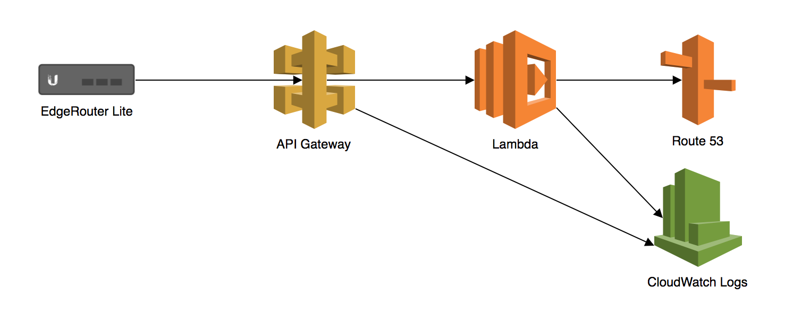

## DynDNS Lambda

Dynamic DNS using AWS Route 53, Lambda and API Gateway. Uses the no-ip protocol.




### Example API Gateway Event
```
{
    u'body': None, 
    u'headers': {
        u'Authorization': u'Basic dG9taGDXFSFDyc29uOlASD3MHJk'
        u'CloudFront-Forwarded-Proto': u'https', 
        u'CloudFront-Is-Desktop-Viewer': u'true', 
        u'CloudFront-Is-Mobile-Viewer': u'false', 
        u'CloudFront-Is-SmartTV-Viewer': u'false', 
        u'CloudFront-Is-Tablet-Viewer': u'false', 
        u'CloudFront-Viewer-Country': u'NZ', 
        u'Host': u'gv1234zd3k.execute-api.ap-southeast-2.amazonaws.com', 
        u'User-Agent': u'ddclient/3.8.3', 
        u'Via': u'1.0 3b8eb123e1e5efb8338be9705dc88912.cloudfront.net (CloudFront)', 
        u'X-Amz-Cf-Id': u'JHX_bzBIENafmzyiERZgg_7AX9AyArSfLQ-GGqiBFPT2WpNBekxC_g==', 
        u'X-Amzn-Trace-Id': u'Root=1-5a1615e9-1694387d449ccf340da97fab', 
        u'X-Forwarded-For': u'203.173.192.122, 54.240.152.89', 
        u'X-Forwarded-Port': u'443', 
        u'X-Forwarded-Proto': u'https', 
    }, 
    u'httpMethod': u'GET',
    u'isBase64Encoded': False
    u'path': u'/nic/update', 
    u'pathParameters': None, 
    u'queryStringParameters': {
        u'hostname': u'vpn.example.com', 
        u'myip': u'10.0.0.1', 
        u'system': u'noip'
    }, 
    u'resource': u'/nic/update', 
    u'requestContext': {
        u'accountId': u'4527012345603', 
        u'apiId': u'gv1234zd3k', 
        u'httpMethod': u'GET', 
        u'identity': {
            u'accessKey': None, 
            u'accountId': None
            u'apiKey': u'', 
            u'caller': None, 
            u'cognitoAuthenticationProvider': None, 
            u'cognitoAuthenticationType': None, 
            u'cognitoIdentityId': None, 
            u'cognitoIdentityPoolId': None, 
            u'sourceIp': u'203.173.192.122', 
            u'user': None, 
            u'userAgent': u'ddclient/3.8.3', 
            u'userArn': None, 
        }, 
        u'path': u'/production/nic/update', 
        u'protocol': u'HTTP/1.1', 
        u'requestId': u'121d1234-cfe5-11e7-99e2-0befa71c00d5', 
        u'requestTime': u'23/Nov/2017:00:27:21 +0000', 
        u'requestTimeEpoch': 1511396841647, 
        u'resourceId': u'2cyhvr', 
        u'resourcePath': u'/nic/update', 
        u'stage': u'production'
    }, 
    u'stageVariables': None, 
}
```